<p align="center">
  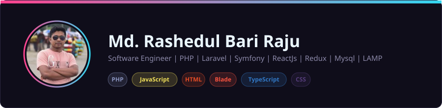
</p>

<p align="center">
  <a href="https://github.com/rbraju3m?tab=followers"></a>
  
  
  
</p>

I'm a **Full Stack Software Engineer** specializing in building robust, high-performance web applications, scalable SaaS platforms, business automation systems, and API-driven applications.

I enjoy turning complex business requirements into clean, maintainable, and production-ready software.

---

## 🚀 About Me

- 💻 Full Stack Software Engineer
- 🧩 Specialized in **Laravel, PHP, React.js and MySQL**
- ⚛️ Building modern frontend applications with **React.js, Redux, Mantine & Tailwind CSS**
- 🚀 Experienced in developing **SaaS and B2B platforms**
- 🔌 Strong experience with **REST APIs & third-party integrations**
- 🗄️ Database design, optimization & performance tuning
- ⚙️ Job queues, background processing & automation
- 💳 Payment gateway integration
- 🐧 Linux server management, Nginx, Apache & SSL/TLS
- ☁️ Deployment and server management with Laravel Forge
- 🔧 Git, GitHub, Bitbucket & CI/CD
- 📦 Experienced with large-scale existing codebases and ERP/POS systems

---

# 🛠️ Tech Stack

### Backend

<p align="left">
  
</p>

- PHP
- Laravel
- Symfony
- REST API
- Authentication & Authorization
- Queue & Job Processing
- Payment Gateway Integration
- API Integration

---

### Frontend

<p align="left">
  
</p>

- React.js
- React Redux
- JavaScript
- HTML5
- CSS3
- Mantine UI
- Tailwind CSS
- Bootstrap
- Responsive Web Design

---

### Database

<p align="left">
  
</p>

- MySQL
- SQLite
- Redis
- Database Design
- Query Optimization
- Indexing
- Data Migration
- Large Dataset Processing

---

### DevOps & Tools

<p align="left">
  
</p>

- Linux
- Nginx
- Apache
- SSL/TLS
- Git
- GitHub
- Bitbucket
- SSH
- Laravel Forge
- CI/CD
- Server Deployment
- Cron Jobs
- Queue Workers

---

# 📊 At a Glance

<p align="center">
  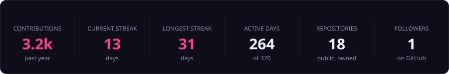
</p>

---

# 📅 Contribution Calendar

<p align="center">
  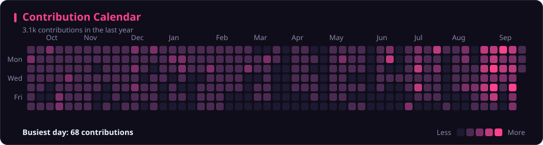
</p>

<p align="center">
  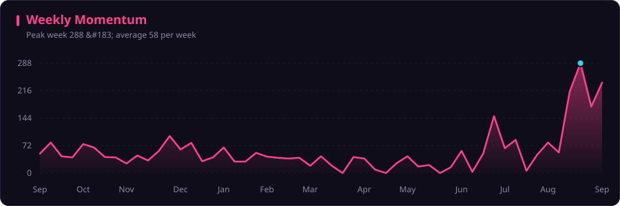
</p>

### 🐍 Watch the graph get eaten

<p align="center">
  <picture>
    <source media="(prefers-color-scheme: dark)" srcset="https://raw.githubusercontent.com/rbraju3m/rbraju3m/output/snake-dark.svg" />
    <source media="(prefers-color-scheme: light)" srcset="https://raw.githubusercontent.com/rbraju3m/rbraju3m/output/snake.svg" />
    
  </picture>
</p>

---

# 🎯 Working Rhythm

<table>
  <tr>
    <td width="50%" align="center">
      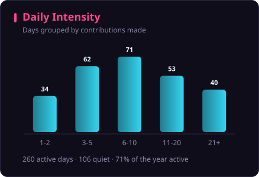
    </td>
    <td width="50%" align="center">
      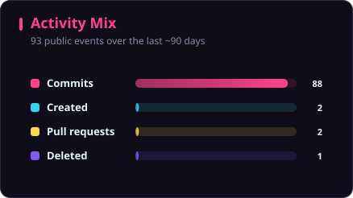
    </td>
  </tr>
</table>

<p align="center">
  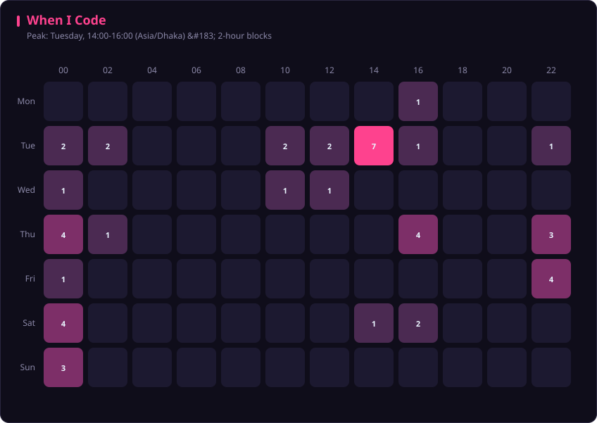
</p>

---

# 🧬 Code & Projects

<table>
  <tr>
    <td width="50%" align="center">
      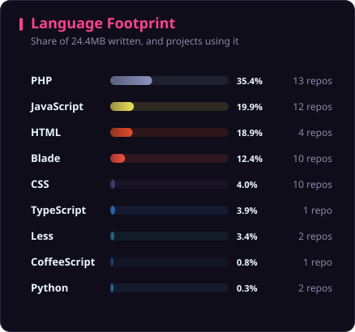
    </td>
    <td width="50%" align="center">
      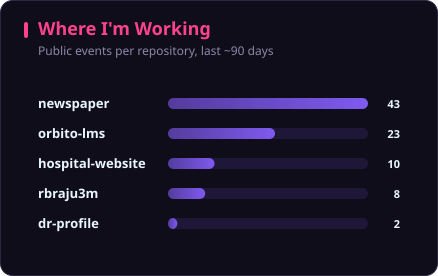
    </td>
  </tr>
</table>

<p align="center">
  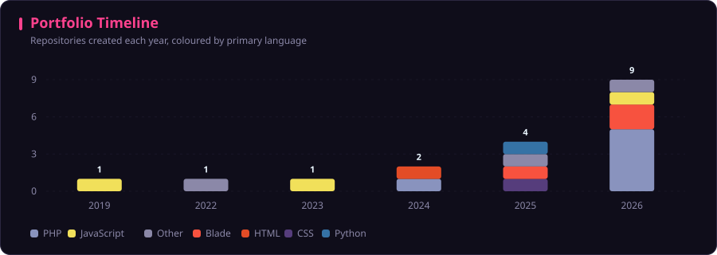
</p>

<p align="center">
  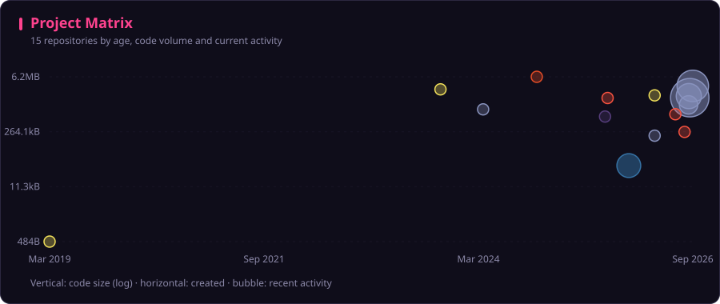
</p>

---

# 💻 Featured Projects

## 🚀 Appza Platform

A complete software ecosystem designed around application building, licensing, APIs and B2B software management.

### Highlights

- Laravel backend
- REST API architecture
- Application builder
- Mobile application management
- License management
- B2B software ecosystem
- Automated application build process
- Cloud storage integration
- Android/iOS application workflow

---

## 🏪 Real-Time POS / ERP System

A scalable business management platform built for real-time sales, inventory and accounting operations.

### Features

- Product Management
- Inventory Management
- Purchase Management
- Sales Management
- Supplier Management
- Customer Management
- Accounting
- Supplier Credit
- Purchase Returns
- Sales Returns
- Payment Management
- Employee Management
- Attendance
- Reporting
- Multi-tenant architecture

### Technology

```text
Laravel
React.js
Redux
MySQL
REST API
Electron
SQLite
