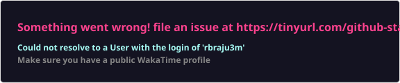

# Hi there! I'm Rashedul Raju 👋

### Full Stack Software Engineer | Laravel | React | SaaS

I am a dedicated **Full Stack Software Engineer** specializing in building robust, high-performance web applications and scalable **SaaS solutions**.

With expertise across the entire stack — from hardened Linux servers and backend architecture to dynamic React frontends — I transform complex business requirements into elegant, maintainable, and scalable software.

---

## 🛠️ Core Technology Stack

| Category | Technologies |
| :--- | :--- |
| **Backend & APIs** | PHP, Laravel, Symfony, MySQL, REST APIs |
| **Frontend & UI** | React.js, Redux, Mantine, Tailwind CSS, JavaScript, Bootstrap |
| **DevOps** | Linux, SSH, Laravel Forge, Nginx, Apache, SSL/TLS |
| **Version Control** | Git, GitHub, Bitbucket |
| **Specializations** | SaaS, ERP, POS, Job Queues, Database Optimization, Payment Integration |

---

## 🚀 What I Build

### 💼 SaaS Ecosystems

Architected and developed the **Appza Platform**, a complete SaaS ecosystem consisting of:

- Laravel-based backend APIs
- License management
- Mobile application builder
- Automated application builds
- Cloud storage integration
- Multi-tenant architecture
- API-driven application ecosystem

### 🏪 POS & ERP Systems

Developed and maintained a full-featured **POS Management System** using:

- Laravel
- React.js
- Redux
- MySQL
- REST APIs

Including:

- Inventory Management
- Sales Management
- Purchase Management
- Accounting
- Supplier Management
- Customer Management
- Reporting

### 📦 Purchase Management System

Led development of a scalable **Purchase Management System (PMS)** using:

- Symfony
- React.js
- MySQL
- REST APIs

### 🏦 Bank Reconciliation System

Developed a sophisticated **Bank Reconciliation System** with custom transaction matching logic.

Features include:

- Automated transaction matching
- Bank statement processing
- Reconciliation workflows
- Exception handling
- Financial reporting

---

# 📊 GitHub Stats & Metrics

## 📈 Core GitHub Stats

<p align="center">
  

  
</p>

---

## 🔥 GitHub Streak

<p align="center">
  
</p>

---

## 🧠 Most Used Languages

<p align="center">
  
</p>

---

## 📈 Contribution Activity

<p align="center">
  
</p>

---

## 🏆 GitHub Achievements

<p align="center">
  
</p>

---

## 📊 Advanced Developer Metrics

<p align="center">
  
</p>

---

## ⏱️ Coding Activity — WakaTime

<p align="center">
  
</p>

---

## 👁️ Profile Views

<p align="center">
  
</p>

---

# 💻 Tech Stack

### Backend

<p>
  
  
  
</p>

### Frontend

<p>
  
  
  
  
  
  
</p>

### Database

<p>
  
  
</p>

### DevOps

<p>
  
  
  
  
  
</p>

---

# 🏗️ Engineering Expertise

```text
Full Stack Development
│
├── Backend
│   ├── Laravel
│   ├── Symfony
│   ├── REST APIs
│   └── Authentication
│
├── Frontend
│   ├── React.js
│   ├── Redux
│   ├── Mantine
│   └── Tailwind CSS
│
├── Database
│   ├── MySQL
│   ├── SQLite
│   ├── Query Optimization
│   └── Data Modeling
│
├── SaaS
│   ├── Multi-tenancy
│   ├── License Management
│   ├── Subscription Systems
│   └── API Ecosystems
│
└── DevOps
    ├── Linux
    ├── Nginx
    ├── Apache
    ├── SSL/TLS
    └── CI/CD
